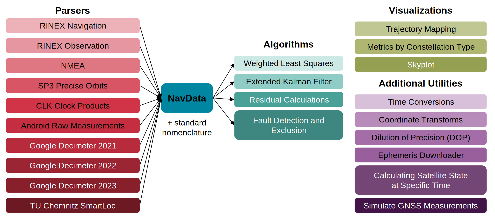

.. gnss_lib_py documentation master file, created by
   sphinx-quickstart on Tue Jul 20 15:36:43 2021.
   You can adapt this file completely to your liking, but it should at least
   contain the root `toctree` directive.

gnss_lib_py
===========
.. _mainpage:

|build|  |codecov|  |documentation|  |colab|

:code:`gnss_lib_py` is a modular Python tool for parsing, analyzing, and
visualizing Global Navigation Satellite Systems (GNSS) data and state
estimates.
It also provides an intuitive and modular framework which allows users to
quickly prototype, implement, and visualize GNSS algorithms.
:code:`gnss_lib_py` is modular in the sense that multiple types of
algorithms or datasets can be easily exchanged for each other.
It is extendable in facilitating user-specific extensions of existing
implementations.

:code:`gnss_lib_py` contains parsers for common file types used for
storing GNSS measurements, benchmark algorithms for processing
measurements into state estimates and visualization tools for measurements
and state estimates.
The modularity of :code:`gnss_lib_py` is made possibly by the unifying
:code:`NavData` class, with accompanying standard nomenclature, which can be
found in the :ref:`reference page<reference>`.
The standard nomenclature ensures cross compatibility between different
datasets and algorithms.

:code:`NavData` combines the readability of :code:`pandas.DataFrame`
with :code:`numpy.ndarray` allowing for easy and fast access of numbers
or strings.
We also provide functionality to add, remove and modify numeric and
string data consistently along with commonly needed supporting
functionality.

Source Code
-----------
All source code is available on GitHub at
`github.com/stanford-navlab/gnss_lib_py <https://github.com/stanford-navlab/gnss_lib_py>`__.

.. _organization:

Code Organization
-----------------

:code:`gnss_lib_py` is organized as:

.. code-block:: bash

   ├── data/                          # Location for data files
      └── unit_test/                  # Data files for unit testing
   ├── dev/                           # Code users do not wish to commit
   ├── docs/                          # Documentation files
   ├── gnss_lib_py/                   # gnss_lib_py source files
        ├── algorithms/               # Navigation algorithms
        ├── navdata/                  # NavData data structure
        ├── parsers/                  # Data parsers
        ├── utils/                    # GNSS and common utilities
        ├── visualizations/           # plotting functions
        └── __init__.py               # Initialize gnss_lib_py
   ├── notebooks/                     # Interactive Jupyter notebooks
        ├── tutorials/                # Notebooks with tutorial code
   ├── results/                       # Location for result images/files
   ├── tests/                         # Tests for source files
      ├── algorithms/                 # Tests for files in algorithms
      ├── navdata/                    # Tests for files in navdata
      ├── parsers/                    # Tests for files in parsers
      ├── utils/                      # Tests for files in utils
      ├── visualizations/             # Tests for files in visualizations
      └── conftest.py                 # Common methods for tests
   ├── CONTRIBUTORS.md                # List of contributors
   ├── build_docs.sh                  # Bash script to build docs
   ├── poetry.lock                    # Poetry specific Lock file
   ├── pyproject.toml                 # List of package dependencies
   └── requirements.txt               # List of packages for pip install

In the directory organization above:

  * The :code:`algorithms` directory contains algorithms that
    work by passing in a :code:`NavData` class. Currently, the following
    algorithms are implemented in the :code:`algorithms`:

      * Weighted Least Squares
      * Extended Kalman Filter
      * Calculating pseudorange residuals
      * Fault detection and exclusion

  * The `navdata` directory defines the `NavData` class, its methods, and
    functions that operate on `NavData` instances, like `sort`, `concat`,
    and others.

  * The data parsers in the :code:`parsers` directory allow for loading
    GNSS data into :code:`gnss_lib_py`'s unifying :code:`NavData` class
    or parsing precise ephemerides data.
    Currently, the following datasets and types are supported:

      * `2021 Google Android Derived Dataset <https://www.kaggle.com/c/google-smartphone-decimeter-challenge>`__
      * `2022 Google Android Derived Dataset <https://www.kaggle.com/competitions/smartphone-decimeter-2022>`__
      * `TU Chemnitz smartLoc Dataset <https://www.tu-chemnitz.de/projekt/smartLoc/gnss_dataset.html.en#Datasets>`__
      * `NMEA <https://www.sparkfun.com/datasheets/GPS/NMEA%20Reference%20Manual-Rev2.1-Dec07.pdf>`__
      * `RINEX .n and .o <https://files.igs.org/pub/data/format/rinex305.pdf>`__
      * `SP3 precise orbits <https://cddis.nasa.gov/Data_and_Derived_Products/GNSS/orbit_products.html>`__
      * `CLK clock products <https://cddis.nasa.gov/Data_and_Derived_Products/GNSS/clock_products.html>`__

  * The :code:`utils` directory contains utilities used to handle
    GNSS measurements, time conversions, coordinate transformations,
    visualizations, calculating multi-GNSS satellite PVT information,
    satellite simulation, file operations, etc.

  * The `visualizations` directory contains methods for plotting quantities
    in `NavData`. It includes methods to plot metrics, positions on maps,
    and skyplots of satellites visible from the receiver position.

Installation
------------

``gnss_lib_py`` is available through ``pip`` installation with:

.. code-block:: bash

   pip install gnss-lib-py

For directions on how to install an editable or developer installation
of ``gnss_lib_py`` on Linux, MacOS, and Windows, please
see the :ref:`install instructions<install>`.

Tutorials
---------
We have a range of tutorials on how to easily use this project. They can
all be found in the :ref:`tutorials section<tutorials>`.

Reference
---------
References on the package contents, explanation of the benefits of our
custom NavData class, and function-level documentation can all be
found in the :ref:`reference section<reference>`.

Contributing
------------
If you have a bug report or would like to contribute to our repository,
please follow the guide on the :ref:`contributing page<contributing>`.

Troubleshooting
---------------
Answers to common questions can be found in the
:ref:`troubleshooting section<troubleshooting>`.

Attribution
-----------
This project is a product of the `Stanford NAV Lab <https://navlab.stanford.edu/>`__
and currently maintained by Daniel Neamati (dneamati [at] stanford [dot] edu)
and Derek Knowles. If using
this project in your own work please cite the following:

.. code-block:: bash

   @inproceedings{knowles_glp_2024,
      title = {gnss_lib_py: Analyzing GNSS data with Python},
      author = {Knowles, Derek and Kanhere, Ashwin Vivek and Neamati, Daniel and Gao, Grace},
      journal = {SoftwareX},
      volume = {27},
      year = {2024},
      publisher = {Elsevier},
      url = {https://github.com/Stanford-NavLab/gnss_lib_py},
      doi = {10.1016/j.softx.2024.101811},
   }

Additionally, we would like to thank `all contributors <https://github.com/Stanford-NavLab/gnss_lib_py/blob/main/CONTRIBUTORS.md>`__ to this project.

.. toctree::
   :maxdepth: 4
   :hidden:

   install
   tutorials/tutorials.rst
   reference/reference.rst
   contributing/contributing.rst
   troubleshooting

.. |build| image:: https://github.com/Stanford-NavLab/gnss_lib_py/actions/workflows/build.yml/badge.svg
   :target: https://github.com/Stanford-NavLab/gnss_lib_py/actions/workflows/build.yml
.. |codecov| image:: https://codecov.io/gh/Stanford-NavLab/gnss_lib_py/branch/main/graph/badge.svg?token=1FBGEWRFM6
   :target: https://codecov.io/gh/Stanford-NavLab/gnss_lib_py
.. |documentation| image:: https://readthedocs.org/projects/gnss_lib_py/badge/?version=latest
   :target: https://gnss-lib-py.readthedocs.io/en/latest/?badge=latest
.. |colab| image:: https://colab.research.google.com/assets/colab-badge.svg
   :target: https://colab.research.google.com/drive/1DYfuiM5ipz0B-lgjKYcL1Si-V4jNBEac?usp=sharing
