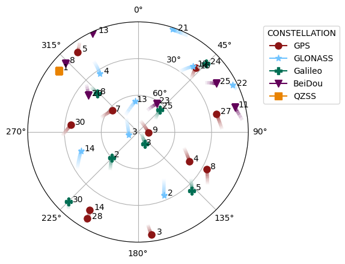

.. gnss_lib_py documentation master file, created by
   sphinx-quickstart on Tue Jul 20 15:36:43 2021.
   You can adapt this file completely to your liking, but it should at least
   contain the root `toctree` directive.

gnss_lib_py
===========

.. _mainpage:

:code:`gnss_lib_py` is a modular Python tool for parsing, analyzing, and
visualizing Global Navigation Satellite Systems (GNSS) data.
It also provides an intuitive and modular framework allowing users to
quickly prototype, implement, and visualize GNSS algorithms.
:code:`gnss_lib_py` is modular in the sense that multiple types of
algorithms can be easily exchanged for each other and extendable in
facilitating user-specific extensions of existing implementations.

:code:`gnss_lib_py` contains parsers for common file types used for
storing GNSS measurements, benchmark algorithms for processing
measurements into state estimates and visualization tools for measurements
and state estimates.
The modularity of :code:`gnss_lib_py` is made possibly by the unifying
:code:`NavData` class, which contains methods to add, remove and modify
numeric and string data consistently.
We provide standard row names for :code:`NavData` elements on the
:ref:`reference page<reference>`.
These names ensure cross compatability between different datasets and
algorithms.

.. _organization:

Code Organization
-----------------

:code:`gnss_lib_py` is organized as:

.. code-block:: bash

   ├── data/                          # Location for data files
      └── unit_test/                  # Data files for unit testing
   ├── dev/                           # Code users do not wish to commit
   ├── docs/                          # Documentation files
   ├── gnss_lib_py/                   # gnss_lib_py source files
        ├── algorithms/               # Navigation algorithms
        ├── parsers/                  # Data parsers
        ├── utils/                    # GNSS and common utilities
        └── __init__.py
   ├── notebooks/                     # Interactive Jupyter notebooks
        ├── tutorials/                # Notebooks with tutorial code
   ├── results/                       # Location for result images/files
   ├── tests/                         # Tests for source files
      ├── algorithms/                 # Tests for files in algorithms
      ├── parsers/                    # Tests for files in parsers
      ├── utils/                      # Tests for files in utils
      └── test_gnss_lib_py.py         # High level checks for repository
   ├── CONTRIBUTORS.md                # List of contributors
   ├── build_docs.sh                  # Bash script to build docs
   ├── poetry.lock                    # Poetry specific Lock file
   ├── pyproject.toml                 # List of package dependencies
   ├── requirements.txt               # List of packages for pip install
   └── setup.py                       # Setup file

In the directory organization above:

  * The :code:`algorithms` directory contains localization algorithms that
    work by passing in a :code:`NavData` class. Currently, the following
    algorithms are implemented in the :code:`algorithms`:

      * Weighted Least Squares
      * Calculating pseudorange residuals
  * The data parsers in the :code:`parsers` directory allow for loading
    GNSS data into :code:`gnss_lib_py`'s unifying :code:`NavData` class.
    Currently, the following datasets and types are supported:

      * `2021 Google Android Derived Dataset <https://www.kaggle.com/c/google-smartphone-decimeter-challenge>`__

  * The :code:`utils` directory contains utilities used to handle
    GNSS measurements, time conversions, visualizations, satellite
    simulation, file operations, etc.
  * Currently, the following data visualization tools are available in the
    :code:`utils` directory:

        * Skyplot: showing the movement of GNSS satellites during the
          elapsed time of the provided :code:`NavData` class.
        * Metric plotting: allows you to plot a specific array of data
          from the :code:`NavData` class
        * Metric plotting by constellation: allows you to plot a specific
          array of data but broken up by individual constellations and
          signal types.
        * Residual plotting: specifically optimized for plotting residuals.

Installation
------------
For directions on how to install the :code:`gnss_lib_py` project, please
see the :ref:`install instructions<install>`.

Tutorials
---------
We have a range of tutorials on how to easily use this project. They can
all be found in the :ref:`tutorials section<tutorials>`.

Reference
---------
References on the package contents, explanation of the benefits of our
custom NavData class, and function-level documentation can all be
found in the :ref:`reference section<reference>`.

Contributing
------------
If you have a bug report or would like to contribute to our repository,
please follow the guide on the :ref:`contributing page<contributing>`.

Troubleshooting
---------------
Answers to common questions can be found in the
:ref:`troubleshooting section<troubleshooting>`.

Attribution
-----------
This project is a product of the `Stanford NAV Lab <https://navlab.stanford.edu/>`__
and currently maintained by Ashwin Kanhere and Derek Knowles. If using
this project in your own work please cite the following:

.. code-block:: bash

   @inproceedings{knowlesmodular2022,
      title = {A Modular and Extendable GNSS Python Library},
      author={Knowles, Derek and Kanhere, Ashwin V and Bhamidipati, Sriramya and Gao, Grace},
      booktitle={Proceedings of the 35th International Technical Meeting of the Satellite Division of The Institute of Navigation (ION GNSS+ 2022)},
      institution = {Stanford University},
      year = {2022 [Online]},
      url = {https://github.com/Stanford-NavLab/gnss_lib_py},
   }

Additionally, we would like to thank `all contributors <https://github.com/Stanford-NavLab/gnss_lib_py/blob/main/CONTRIBUTORS.md>`__ to this project.

.. toctree::
   :maxdepth: 4
   :hidden:

   install
   tutorials/tutorials.rst
   reference/reference.rst
   contributing/contributing.rst
   troubleshooting
